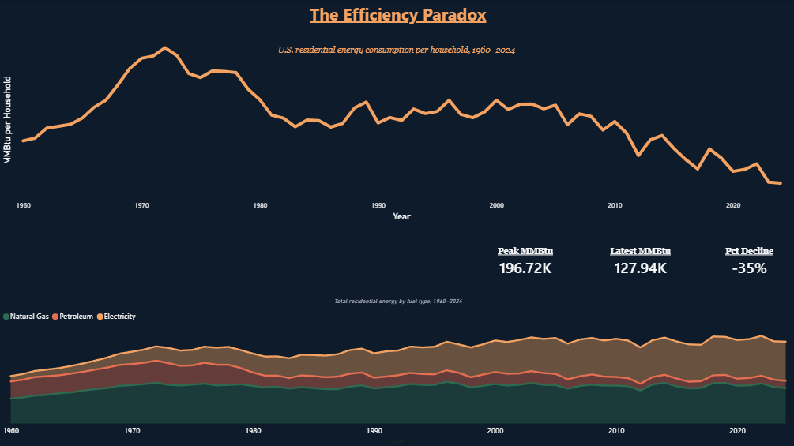
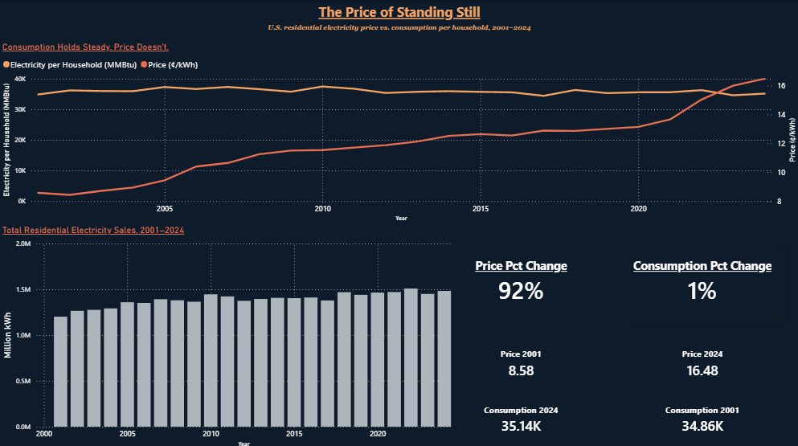
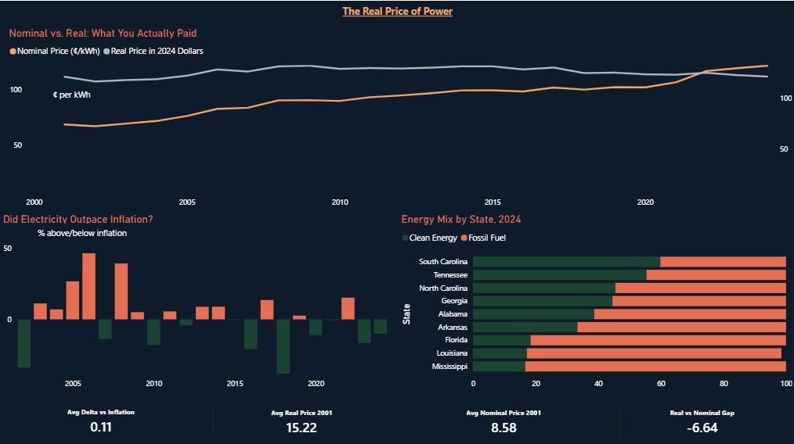

# The Efficiency Paradox: U.S. Residential Energy Consumption, 1960–2024

How much energy does the average American household actually use — and has all the "efficiency" we keep hearing about really moved the needle?

## The Idea

This one started as a peaky curiosity. I kept thinking back to the 1960s and 70s, when energy was cheap and nobody thought twice about leaving the lights on. That ran straight into the oil crisis era, then decades of efficiency standards — better refrigerators, better HVAC, better everything. So the assumption is we should be using way less energy per household today than we were back then.

But at the same time, we've added a ton of new load to the grid that didn't exist in 1970: computers, streaming, smart home devices, EVs charging in the garage, and now AI and data centers pulling serious power behind the scenes. So which force wins? Did the efficiency gains actually stick, or did we just trade old energy use for new energy use?

I wanted to pull the real numbers and find out — not guess, not assume, just look at 60+ years of data and see what the trend actually says.

## V2 Update — Built from LinkedIn Feedback

After publishing the original project, [Matt Meier](https://www.linkedin.com/in/matt-meier-msda-mba/) (Director of Investment Data Operations, 1x Tableau Viz of the Day) raised two critical points:

1. **Inflation matters** — nominal electricity prices climbing 92% since 2001 looks alarming, but how does that compare to general inflation? Are people actually paying more in real terms?
2. **Energy mix matters** — do states running on cleaner energy sources have more stable prices than fossil-fuel-heavy states?

Both were exactly right. Dashboard 3 is a direct response to that feedback, built with a new dataset pulling state-level Southeast electricity prices, CPI adjustment, and generation mix by fuel type.

## What I Found

**National picture (Dashboards 1 & 2):**
Household energy consumption peaked hard in the early-to-mid 1970s right around the oil crisis, then fell off a cliff once efficiency standards kicked in through the 80s and 90s. Total residential energy per household is down about 35% from its peak. But zoom into just the last 20+ years and electricity consumption per household has barely moved, while the price per kilowatt-hour has climbed 92%. So even in the era of "smart" and efficient everything, people are paying a lot more to use roughly the same amount of power.

**The inflation-adjusted reality (Dashboard 3):**
Once you adjust for inflation the story changes. In 2001 you paid 8.58¢/kWh — but in today's dollars that same price is worth 15.22¢. You're actually paying 16.48¢ now, meaning electricity outpaced general inflation by only about 1.26¢ over 23 years. The average annual delta vs. inflation across the entire period is just 0.11% — essentially a wash. The 92% nominal increase sounds dramatic. The real increase is much more modest.

**The Southeast energy mix:**
South Carolina and Tennessee run the cleanest grids in the region, with over 50% clean generation. Mississippi and Louisiana sit at the opposite end — almost entirely fossil fuel dependent. Whether that correlates with long-term price stability is the next question worth exploring.

## Tools

| Tool | Role |
|---|---|
| Python (pandas, requests) | API/bulk data pulls, cleaning, merging |
| EIA API v2 | Electricity retail sales, price, and generation by fuel type |
| EIA SEDS bulk data | Residential energy by fuel type (1960–2024) |
| BLS CPI-U | Hardcoded annual averages for inflation adjustment |
| Power BI Desktop | All three dashboards, DAX measures |
| US Census data | Population & housing unit normalization |

## Methodology

**Scripts 01–03** handle the national pipeline:
1. **EIA API pull** — national residential electricity sales and price, 2001–2024
2. **SEDS bulk pull** — residential energy by fuel type back to 1960
3. **Merge & clean** — joins both datasets, normalizes per household using Census figures, tags era labels

**Script 04** handles the Southeast V2 pipeline:
- Pulls state-level residential electricity prices for 9 Southeast states (AL, AR, FL, GA, LA, MS, NC, SC, TN) plus US national from EIA API
- Pulls generation by fuel type (Coal, Natural Gas, Nuclear, Hydro, Wind, Solar) per state from EIA electric power operational data
- Applies BLS CPI-U deflator (hardcoded, base year 2024) to compute real prices
- Calculates YoY nominal vs. real price changes and delta vs. inflation
- Outputs three CSVs: `electricity_vs_inflation.csv`, `generation_by_source.csv`, `combined_analysis.csv`

## Dashboards

**Dashboard 1 — The Efficiency Paradox**
The headline arc: total residential energy use per household from 1960–2024, with the fuel-type breakdown stacked underneath. Peak, latest, and percent decline called out as KPIs.

**Dashboard 2 — The Price of Standing Still**
2001–2024 only. Dual-axis line chart puts electricity consumption per household next to price per kWh — consumption is essentially flat, price is not. Total electricity sales volume and KPI cards complete the picture.

**Dashboard 3 — The Real Price of Power** *(Added in V2, prompted by LinkedIn feedback)*
Southeast state-level analysis with inflation adjustment. Nominal vs. real price comparison, year-by-year delta vs. inflation bar chart, and 2024 energy mix by state. Directly addresses the question: did electricity actually outpace inflation?

## Key Findings

- Peak household energy consumption: ~197K MMBtu (early-to-mid 1970s)
- 2024 consumption: ~128K MMBtu — down 35% from peak
- Nominal electricity price increase since 2001: 92% (8.58¢ → 16.48¢)
- Real price increase since 2001 (inflation-adjusted): ~8% — electricity barely outpaced CPI
- Average annual delta vs. inflation 2001–2024: 0.11% — essentially a wash
- South Carolina: cleanest grid in the Southeast at ~60% clean generation in 2024
- Mississippi: most fossil-fuel dependent at ~95% fossil in 2024
- Georgia energy mix shift: ~64% fossil (2021) → ~54% fossil (2025), driven by Plant Vogtle nuclear units 3 & 4

## What I Learned as an Analyst

EIA's public data is genuinely messy to work with — the API and the bulk file formats don't always agree with each other, MSN codes get silently truncated, and column names shift between datasets that are supposedly part of the same system. A lot of this project was less about the visualization and more about being stubborn enough to keep tracing errors back to their root instead of settling for a workaround.

The bigger lesson came from the V2 iteration: publishing your work and inviting critique makes the analysis better. The 92% nominal price increase I highlighted originally isn't wrong — but it's incomplete without inflation context. That one piece of feedback from Matt turned a solid project into a more honest one.

## Files

| File | Description |
|---|---|
| `py/01_pull_eia_api.py` | National electricity sales & price from EIA API |
| `py/02_pull_seds.py` | Residential energy by fuel type from SEDS bulk file |
| `py/03_merge_clean.py` | Merges, normalizes, outputs national dataset |
| `py/04_etl_electricity_v2.py` | Southeast state-level ETL — prices, CPI adjustment, energy mix |
| `csv/energy_consumption_final.csv` | Final national dataset, 1960–2024 |
| `csv/electricity_vs_inflation.csv` | US + SE states, nominal vs. real price, 2001–2024 |
| `csv/generation_by_source.csv` | SE state generation by fuel type, 2001–2024 |
| `csv/combined_analysis.csv` | SE states price + energy mix merged, main Dashboard 3 source |
| `Energy_Consumption_Analysis.pbix` | Power BI file — all three dashboards |
| `screenshots/dashboard-1-the-efficiency-paradox.png` | Dashboard 1 screenshot |
| `screenshots/dashboard-2-the-price-of-standing-still.png` | Dashboard 2 screenshot |
| `screenshots/dashboard-3-the-real-price-of-power.png` | Dashboard 3 screenshot |

## Connect

- [LinkedIn](https://www.linkedin.com/in/bryce-gardner-16a889183)
- [GitHub](https://github.com/brycegardner90)
- Related project: [Southeast AC & Population Boom](https://github.com/brycegardner90/southeast-ac-population-boom)
